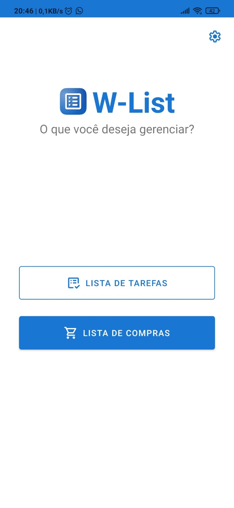
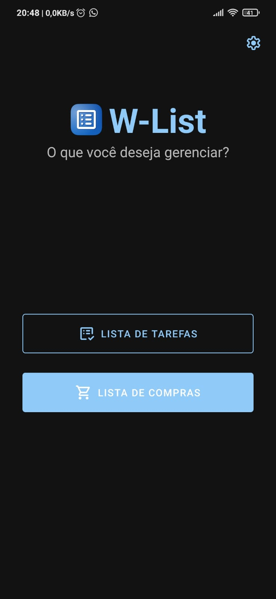
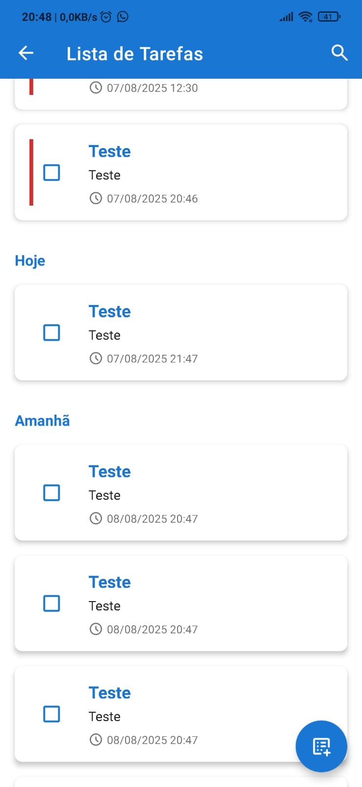
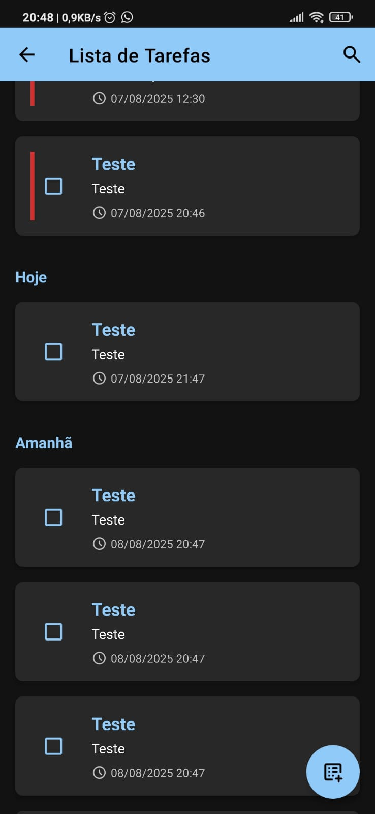
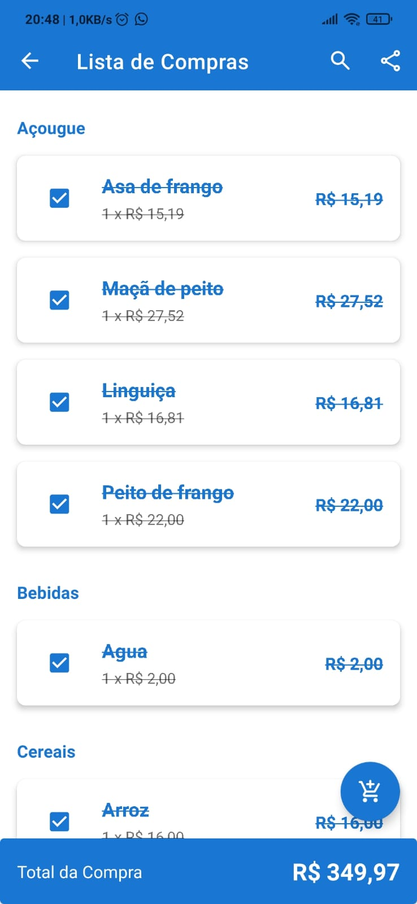
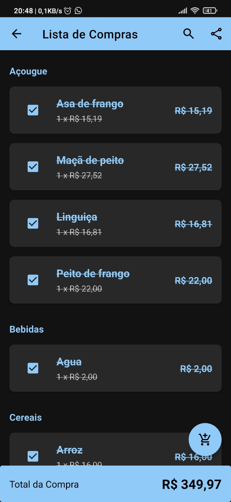
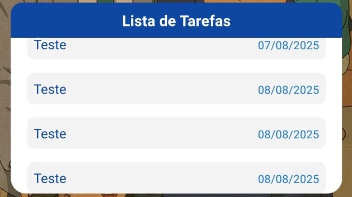
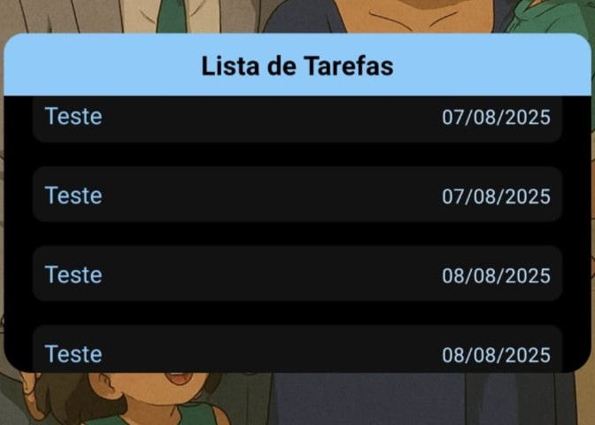

<!-- Seletor de Idiomas -->

  <b><a href="#-w-list-gerenciador-de-tarefas-e-compras-pt-br">🇧🇷 Português</a></b>
  &nbsp;&nbsp;|&nbsp;&nbsp;
  <b><a href="#-w-list-task-and-shopping-manager-en-us">🇬🇧 English</a></b>
  &nbsp;&nbsp;|&nbsp;&nbsp;
  <b><a href="#-w-list-gestor-de-tareas-y-compras-es-es">🇪🇸 Español</a></b>

---

<!-- 
=====================================================================
======================= VERSÃO EM PORTUGUÊS =======================
=====================================================================
-->

# W-List: Gerenciador de Tarefas e Compras

W-List é um aplicativo Android nativo, construído com Kotlin, projetado para ser um assistente pessoal simples, mas poderoso, para gerenciar duas das listas mais comuns do dia a dia: tarefas e compras. O projeto foi desenvolvido seguindo as melhores práticas e a arquitetura moderna do Android, servindo como um portfólio completo que demonstra desde a criação de UI até funcionalidades avançadas do sistema. O aplicativo está disponível em **Português, Inglês e Espanhol**.

## Screenshots

O W-List possui uma interface limpa e consistente, com suporte completo aos temas claro e escuro do sistema.

<table>
  <tr>
    <td colspan="2" align="center" width="800"><b>Tela Inicial</b></td>
  </tr>
  <tr>
    <td align="center" width="400">
      
    </td>
    <td align="center" width="400">
      
    </td>
  </tr>

  <tr>
    <td colspan="2" align="center" width="800"><b>Lista de Tarefas</b></td>
  </tr>
  <tr>
    <td align="center" width="400">
      
    </td>
    <td align="center" width="400">
      
    </td>
  </tr>

  <tr>
    <td colspan="2" align="center" width="800"><b>Lista de Compras</b></td>
  </tr>
  <tr>
    <td align="center" width="400">
      
    </td>
    <td align="center" width="400">
      
    </td>
  </tr>
  
  <tr>
    <td colspan="2" align="center" width="800"><b>Widget na Tela Inicial</b></td>
  </tr>
  <tr>
    <td align="center" width="400">
      
    </td>
    <td align="center" width="400">
      
    </td>
  </tr>
</table>

## Funcionalidades Principais

O W-List foi construído com um foco em usabilidade e funcionalidades inteligentes:

#### 📋 Lista de Tarefas
- **Agrupamento Automático por Data:** As tarefas são organizadas em seções intuitivas: "Atrasadas", "Hoje", "Amanhã", "Esta Semana", "Este Mês", "Próximos Meses" e "Concluídas".
- **Lembretes com Notificações:** Agende tarefas para uma data e hora específicas e receba notificações, mesmo com o aplicativo fechado.
- **Ações na Notificação:** Marque uma tarefa como "Concluída" ou "Adie por 10 min" diretamente da notificação.
- **Interatividade Completa:**
  - **Deslizar para Deletar:** Remova tarefas com um simples gesto, com a opção de "Desfazer".
  - **Arrastar para Reordenar:** Pressione e segure para organizar manualmente a prioridade das suas tarefas.

#### 🛒 Lista de Compras
- **Agrupamento por Categorias:** Organize seus itens por categorias (ex: Hortifruti, Padaria) para facilitar suas compras no supermercado.
- **Auto-completar Categorias:** O app aprende e sugere categorias que você já usou.
- **Cálculo de Total em Tempo Real:** Acompanhe o valor total da sua compra, que é atualizado com uma animação suave a cada alteração.
- **Compartilhamento Fácil:** Exporte sua lista de compras formatada como texto para qualquer aplicativo de mensagens.
- **Interatividade Completa:** Também suporta "Deslizar para Deletar" e "Arrastar para Reordenar" itens dentro das categorias.

#### ⚙️ Configurações e Personalização
- **Internacionalização (i18n):** Suporte completo para **Português (padrão), Inglês e Espanhol**. Todo o texto, incluindo formatação de moeda (R$, $, €), se adapta ao idioma selecionado.
- **Tema Claro e Escuro:** O aplicativo se adapta automaticamente ao tema do sistema, mas o usuário pode forçar a preferência no menu de configurações.

#### 📱 Widget na Tela Inicial
- **Visibilidade Constante:** Um widget elegante exibe as próximas tarefas não concluídas diretamente na tela inicial.
- **Atualização em Tempo Real:** O widget é atualizado automaticamente sempre que uma tarefa é adicionada, editada ou concluída no aplicativo.
- **Adaptável ao Tema:** O widget também se adapta aos temas claro e escuro do sistema.

## Arquitetura e Tecnologias Utilizadas

Este projeto foi uma oportunidade para explorar e implementar a arquitetura Android moderna.

-   **Linguagem:** **Kotlin** 100%, utilizando recursos como **Coroutines** para um código assíncrono, limpo e eficiente.
-   **Arquitetura:**
    -   **Padrão de Repositório:** Abstrai as fontes de dados da lógica de negócios.
-   **Persistência de Dados:**
    -   **Room Database:** A biblioteca de persistência recomendada pelo Google, usada como a única fonte da verdade para todos os dados do aplicativo.
-   **Interface do Usuário (UI):**
    -   **Material Design:** Componentes modernos (`MaterialToolbar`, `FloatingActionButton`, etc.) para uma UI consistente.
    -   **`RecyclerView`:** Utilizado para exibir listas de forma eficiente, com suporte a múltiplos tipos de `View` (para cabeçalhos), `DiffUtil` para atualizações animadas e `ItemTouchHelper` para gestos de deslizar e arrastar.
-   **Dependências Principais:**
    -   **Android Jetpack:**
        -   Room
        -   Lifecycle (`lifecycleScope`)
        -   Preference KTX (para a tela de configurações)
    -   **Coroutines** para gerenciamento de threads.
    -   **`RecyclerViewSwipeDecorator`** para customizar a UI dos gestos de deslize.

## Como Compilar e Rodar o Projeto

1.  Clone este repositório.
2.  Abra o projeto no Android Studio.
3.  O Gradle cuidará de baixar todas as dependências necessárias.
4.  Compile e rode em um emulador ou dispositivo físico (API 28+).

## Aprendizados e Próximos Passos

Este projeto foi uma jornada completa pelo ecossistema de desenvolvimento Android. Os próximos passos para evoluir o W-List poderiam incluir:

-   [ ] Implementar sub-tarefas dentro de uma tarefa principal.
-   [ ] Adicionar prioridades (Baixa, Média, Alta) às tarefas.
-   [ ] Criar um sistema de login para sincronização de listas na nuvem.

---
*Este projeto foi desenvolvido como um estudo aprofundado de desenvolvimento Android nativo com Kotlin.*

   

<!-- 
=====================================================================
======================== ENGLISH VERSION ========================
=====================================================================
-->

# W-List: Task and Shopping Manager

W-List is a native Android application, built with Kotlin, designed to be a simple yet powerful personal assistant for managing two of the most common everyday lists: to-dos and shopping. The project was developed following modern Android architecture and best practices, serving as a comprehensive portfolio that showcases everything from UI creation to advanced system features. The app is available in **Portuguese, English, and Spanish**.

## Screenshots

W-List features a clean and consistent interface with full support for the system's light and dark themes.

<table>
  <tr>
    <td colspan="2" align="center" width="800"><b>Home Screen</b></td>
  </tr>
  <tr>
    <td align="center" width="400">
      
    </td>
    <td align="center" width="400">
      
    </td>
  </tr>

  <tr>
    <td colspan="2" align="center" width="800"><b>To-Do List</b></td>
  </tr>
  <tr>
    <td align="center" width="400">
      
    </td>
    <td align="center" width="400">
      
    </td>
  </tr>

  <tr>
    <td colspan="2" align="center" width="800"><b>Shopping List</b></td>
  </tr>
  <tr>
    <td align="center" width="400">
      
    </td>
    <td align="center" width="400">
      
    </td>
  </tr>
  
  <tr>
    <td colspan="2" align="center" width="800"><b>Home Screen Widget</b></td>
  </tr>
  <tr>
    <td align="center" width="400">
      
    </td>
    <td align="center" width="400">
      
    </td>
  </tr>
</table>

## Key Features

W-List was built with a focus on usability and smart features:

#### 📋 To-Do List
- **Automatic Date Grouping:** Tasks are organized into intuitive sections: "Overdue," "Today," "Tomorrow," "This Week," "This Month," "Next Months," and "Completed."
- **Reminders with Notifications:** Schedule tasks for a specific date and time and receive notifications, even when the app is closed.
- **Notification Actions:** Mark a task as "Done" or "Snooze for 10 min" directly from the notification.
- **Full Interactivity:**
  - **Swipe to Delete:** Remove tasks with a simple gesture, with an "Undo" option.
  - **Drag to Reorder:** Long-press to manually organize the priority of your tasks.

#### 🛒 Shopping List
- **Category Grouping:** Organize your items by categories (e.g., Produce, Bakery) to streamline your grocery shopping.
- **Category Autocomplete:** The app learns and suggests categories you have used before.
- **Real-Time Total Calculation:** Keep track of your total purchase amount, which updates with a smooth animation on every change.
- **Easy Sharing:** Export your formatted shopping list as plain text to any messaging app.
- **Full Interactivity:** Also supports "Swipe to Delete" and "Drag to Reorder" within categories.

#### ⚙️ Settings and Personalization
- **Internationalization (i18n):** Full support for **Portuguese (default), English, and Spanish**. All text, including currency formatting (R$, $, €), adapts to the selected language.
- **Light & Dark Theme:** The app automatically adapts to the system theme, but the user can also force a preference in the settings menu.

#### 📱 Home Screen Widget
- **Constant Visibility:** An elegant widget displays upcoming uncompleted tasks directly on the home screen.
- **Real-Time Updates:** The widget automatically updates whenever a task is added, edited, or completed in the app.
- **Theme-Aware:** The widget also adapts to the system's light and dark themes.

## Architecture and Technologies Used

This project was an opportunity to explore and implement modern Android architecture.

-   **Language:** 100% **Kotlin**, utilizing features like **Coroutines** for clean, efficient, and asynchronous code.
-   **Architecture:**
    -   **Repository Pattern:** Abstracts data sources from the business logic.
-   **Data Persistence:**
    -   **Room Database:** Google's recommended persistence library, used as the single source of truth for all application data.
-   **User Interface (UI):**
    -   **Material Design:** Modern components (`MaterialToolbar`, `FloatingActionButton`, etc.) for a consistent UI.
    -   **`RecyclerView`:** Used to efficiently display lists, with support for multiple `View` types (for headers), `DiffUtil` for animated updates, and `ItemTouchHelper` for swipe and drag gestures.
-   **Key Dependencies:**
    -   **Android Jetpack:**
        -   Room
        -   Lifecycle (`lifecycleScope`)
        -   Preference KTX (for the settings screen)
    -   **Coroutines** for thread management.
    -   **`RecyclerViewSwipeDecorator`** to customize the UI of swipe gestures.

---
*This project was developed as an in-depth study of native Android development with Kotlin.*

   

<!-- 
=====================================================================
======================= SPANISH VERSION =======================
=====================================================================
-->

# W-List: Gestor de Tareas y Compras

W-List es una aplicación nativa de Android, construida con Kotlin, diseñada para ser un asistente personal simple pero potente para gestionar dos de las listas más comunes del día a día: tareas y compras. El proyecto fue desarrollado siguiendo las mejores prácticas y la arquitectura moderna de Android, sirviendo como un portafolio completo que demuestra desde la creación de UI hasta funcionalidades avanzadas del sistema. La aplicación está disponible en **Portugués, Inglés y Español**.

## Capturas de Pantalla

W-List cuenta con una interfaz limpia y consistente, con soporte completo para los temas claro y oscuro del sistema.

<table>
  <tr>
    <td colspan="2" align="center" width="800"><b>Pantalla de Inicio</b></td>
  </tr>
  <tr>
    <td align="center" width="400">
      
    </td>
    <td align="center" width="400">
      
    </td>
  </tr>

  <tr>
    <td colspan="2" align="center" width="800"><b>Lista de Tareas</b></td>
  </tr>
  <tr>
    <td align="center" width="400">
      
    </td>
    <td align="center" width="400">
      
    </td>
  </tr>

  <tr>
    <td colspan="2" align="center" width="800"><b>Lista de Compras</b></td>
  </tr>
  <tr>
    <td align="center" width="400">
      
    </td>
    <td align="center" width="400">
      
    </td>
  </tr>
  
  <tr>
    <td colspan="2" align="center" width="800"><b>Widget en la Pantalla de Inicio</b></td>
  </tr>
  <tr>
    <td align="center" width="400">
      
    </td>
    <td align="center" width="400">
      
    </td>
  </tr>
</table>

## Características Principales

W-List fue construido con un enfoque en la usabilidad y funcionalidades inteligentes:

#### 📋 Lista de Tareas
- **Agrupación Automática por Fecha:** Las tareas se organizan en secciones intuitivas: "Atrasadas", "Hoy", "Mañana", "Esta Semana", "Este Mes", "Próximos Meses" y "Completadas".
- **Recordatorios con Notificaciones:** Programa tareas para una fecha y hora específicas y recibe notificaciones, incluso con la aplicación cerrada.
- **Acciones en la Notificación:** Marca una tarea como "Completada" o "Pospón 10 min" directamente desde la notificación.
- **Interactividad Completa:**
  - **Deslizar para Eliminar:** Elimina tareas con un simple gesto, con la opción de "Deshacer".
  - **Arrastrar para Reordenar:** Mantén presionado para organizar manualmente la prioridad de tus tareas.

#### 🛒 Lista de Compras
- **Agrupación por Categorías:** Organiza tus artículos por categorías (ej: Frutas y Verduras, Panadería) para facilitar tus compras en el supermercado.
- **Autocompletar Categorías:** La app aprende y sugiere categorías que ya has utilizado.
- **Cálculo del Total en Tiempo Real:** Sigue el monto total de tu compra, que se actualiza con una suave animación con cada cambio.
- **Compartir Fácilmente:** Exporta tu lista de compras formateada como texto a cualquier aplicación de mensajería.
- **Interactividad Completa:** También soporta "Deslizar para Eliminar" y "Arrastrar para Reordenar" artículos dentro de las categorías.

#### ⚙️ Configuración y Personalización
- **Internacionalización (i18n):** Soporte completo para **Portugués (predeterminado), Inglés y Español**. Todo el texto, incluido el formato de moneda (R$, $, €), se adapta al idioma seleccionado.
- **Tema Claro y Oscuro:** La aplicación se adapta automáticamente al tema del sistema, pero el usuario también puede forzar una preferencia en el menú de configuración.

#### 📱 Widget en la Pantalla de Inicio
- **Visibilidad Constante:** Un elegante widget muestra las próximas tareas no completadas directamente en la pantalla de inicio.
- **Actualizaciones en Tiempo Real:** El widget se actualiza automáticamente cada vez que se añade, edita o completa una tarea en la aplicación.
- **Adaptable al Tema:** El widget también se adapta a los temas claro y oscuro del sistema.

## Arquitectura y Tecnologías Utilizadas

Este proyecto fue una oportunidad para explorar e implementar la arquitectura moderna de Android.

-   **Lenguaje:** 100% **Kotlin**, utilizando características como **Coroutines** para un código asíncrono, limpio y eficiente.
-   **Arquitectura:**
    -   **Patrón de Repositorio:** Abstrae las fuentes de datos de la lógica de negocio.
-   **Persistencia de Datos:**
    -   **Room Database:** La biblioteca de persistencia recomendada por Google, utilizada como la única fuente de verdad para todos los datos de la aplicación.
-   **Interfaz de Usuario (UI):**
    -   **Material Design:** Componentes modernos (`MaterialToolbar`, `FloatingActionButton`, etc.) para una UI consistente.
    -   **`RecyclerView`:** Utilizado para mostrar listas de manera eficiente, con soporte para múltiples tipos de `View` (para encabezados), `DiffUtil` para actualizaciones animadas, y `ItemTouchHelper` para gestos de deslizar y arrastrar.
-   **Dependencias Clave:**
    -   **Android Jetpack:**
        -   Room
        -   Lifecycle (`lifecycleScope`)
        -   Preference KTX (para la pantalla de configuración)
    -   **Coroutines** para la gestión de hilos.
    -   **`RecyclerViewSwipeDecorator`** para personalizar la UI de los gestos de deslizar.

---
*Este proyecto fue desarrollado como un estudio a fondo del desarrollo nativo de Android con Kotlin.*
